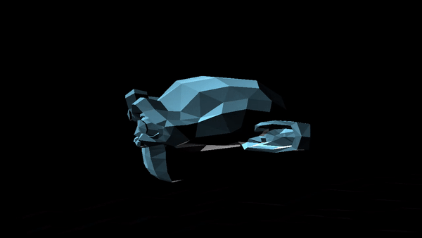

# Flatter

A C++ Vulkan sanbox built with the intent of learning Vulkan and some advanced rendering techiques.

## Rendering

A GBuffer consisting of worldspace positions, albedo and normals is stored in three independant framebuffer attachments and read at the next step. Lights information is sent through a uniform buffer, while transforms are recorded into de command buffer as push constants, lights are capped at a maximum, determined at runtime as set by a specialization constant.